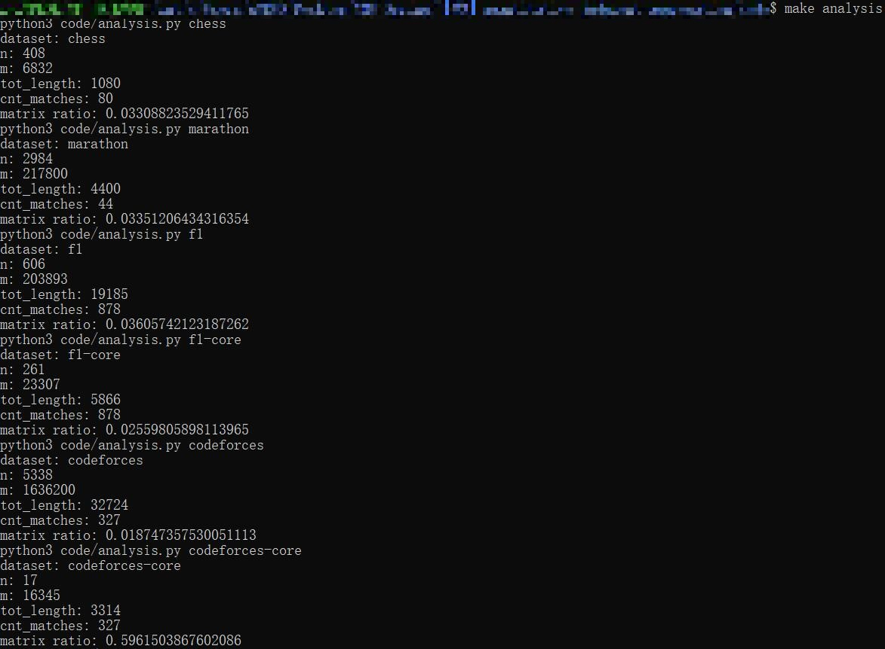

# Aggregating Quantitative Relative Judgments: From Social Choice to Ranking Prediction

## Table of Contents

- [General Information](#general-information)
- [Screenshots](#screenshots)
- [Technologies Used](#technologies-used)
- [File Structure](#file-structure)
- [Reproducing the Experiments](#reproducing-the-experiments)

## General Information

This repository contains the source code for the experiments in the NeurIPS paper: Aggregating Quantitative Relative Judgments: From Social Choice to Ranking Prediction. We implemented L1, L2 QRJA and other benchmarks and tested their performances under several conditions.

The authors are currently anonymous.

## Technologies Used

- Gurobi Version 10.0
- NetworkX Version 3.1
- Scipy Version 1.10.1

## Screenshots

Information about the datasets, produced by the scripts:



## File Structure

The repository contains the following directories:

- `code`: the source code of the algorithms.
- `data`: the datasets used in the experiments.
- `figures`: the figures used in the paper.
- `logs`: the logs of the experiments.
- `plot`: the scripts to generate the figures.

## Reproducing the Experiments

We have written a set of scripts so that the experiments are easily reproduced. Although the source code of algorithms is cross-platform, the scripts use `bash` and `make`, so they only work under Linux-like systems (including Windows Subsystem for Linux).

- To analyze the sizes of the datasets used, enter

  ``` bash
  make analysis
  ```

- To re-run the main experiments, enter

  ``` bash
  make main
  make subsample
  make overtime
  make entrywise
  make zero
  ```

- To generate the figures used in the paper, enter

  ``` bash
  make plotmain
  make plotsubsample
  make plotovertime
  make plotentrywise
  make plotmf
  ```